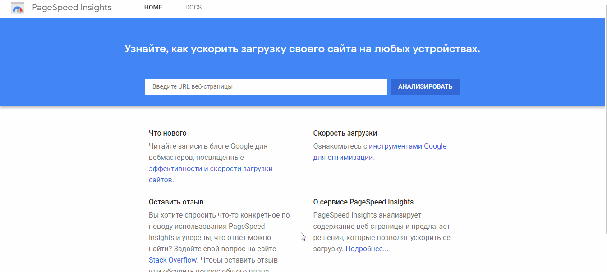

Некоммерческий проект [Travel with Odigo](https://odigo-stewiebutthurt.herokuapp.com/)

Проект развернут на бесплатном хостинге [heroku](https://www.heroku.com/)  

При создании проекта, использовался стек технологий 
- NuxtJs (Vue) 
- NodeJs (express)
- mongoDB
- smart-grid 
- Sass
- Vuetify

Так же использовались вспомогательные модули из npm, список который вы можете найти в **package.json**

## Почему NuxtJs? 
Nuxt дает возможность писать full-stack приложение. По мимо этого в нем используется подход формирования DOM на стороне сервера SSR (Server Side Rendering), что очень хорошо для SEO. 

## Введение
Дизайн главной страницы взят из сети. 
Дизайн подстраниц выполнил [@yakirya_](https://www.instagram.com/yakirya_/)
 
Основной язык проекта - английский. 
Проект является лендингом, и включается в себя страницы:
- Главная
- Динамические страницы о местах в Японии
- Авторизация (Login)
- Админская панель

Так же в проекте реализован подход SPA (single page application). То есть переход между разделами происходит без перезагрузки страницы. 
Имеется адаптивная верстка под разные экраны. От 340px до 1920px

## Функции
- проверка на реального пользователя, с помощью капчи

**Со стороны пользователя:**
- отображение списка постов
- просмотр подробной информации и месте в Японии
- реализация обратной связи с покупателями через форму.

**Со стороны владельца**
- авторизация в панели администратора
- добавление нового поста

- редактирование сущетсвующих постов (название, описание)

- удаление поста

- добавление нового пользователя

## Описание
**Home** 

 - Презентационный раздел

**Benefits of Odigo**

- Раздел с преимуществами

**Get inspired for your next trip**

- Места для вдохновения в Японии

**Popular places to visit**

- Популярные места в Японии

**Video**

- Видео с прогулкой по Токио

**Footer**

- Раздел с контактами

**Places/City**

- Страница с подробным описанием выбранного места

**Login**

- Используется для аутентификации в панели администратора

## Описание панели администратора

Панель администратора содержит 3 подстраницы:

**Home**
- Подстраница с приветствием 

**Analytics**

- Подстраница для аналитических инструментов (пустая)

**Edit city**

- Подстраница для редактирования постов

**Add city**

- Подстраница для добавления постов

**Create user**

- Подстраница для добавления новых администраторов

**Log Out**

- Кнопка для выхода из админской панели

## Интересные задачи и их решения

**SSR**
  В разделе с постами, список постов берется с сервера, в момент когда вы только перешли на страницу [Travel with Odigo](https://odigo-stewiebutthurt.herokuapp.com), формируется GET запрос на сервер, где формируется запрос в базу данных, откуда возвращается список постов. После чего компонент Vue его отрисовывает. Но вот проблема, если мы будем использовать обычный Vue, то запрос к серверу будет происходить из вашего браузера, в момент формирования компонента. При таком раскладе, в исходном коде страницы, будет отсутствовать HTML разметка с постами, а значит алгоритмы поисковиков не увидят наши посты (плохой SEO). Эту проблему решает Nuxt, он формирует DOM не на стороне клиента (из браузера) как обычный Vue,  а на стороне сервера. Тем самым запрос к БД произойдет перед формированием всей главной страницы, и в исходном коде будет присутствовать разметка с постами (ура, поисковики видят наши посты).  

**Хранение картинок в базе**
   У Heroku локальный диск является "эфемерным". Когда приложение "засыпает", его диск уничтожается, а когда "будят" содается новый, отдельный на каждую машину. Из этого следует, что добавлять картинки с помощью панели администратора в файловую систему Heroku мы не сможем. Поэтому я использовал сторонний сервис для некоммерческого хранения картинок под названием [ImgBB](https://imgbb.com/). Когда администратор добавляет новый пост с картинками. Картинки сжимаются на сервере, после чего отправляются на ImgBB, в ответ возвращается список URL-адресов, по которым доступны картинки. Этот список записывается в базу данных, откуда потом заправшивается при рендеренге постов.

**Оптимизация**
   Для того чтобы сайт быстро загружался я использовал ленивую загрузку картинок и компонентов. В этом мне помог модуль из npm [nuxt-lazy-load](https://www.npmjs.com/package/nuxt-lazy-load/v/latest) и встроенный компонент lazy из [Vutify.js](https://vuetifyjs.com/ru/).
 
По мимо этого, в проекте используются динамические импорты, для того чтобы в итоговый bundle попадало то, что необходимо в первую очередь, остальной код подгружается когда потребуется.

**Настройка SEO**
   Для настройки Search Engine Optimization использовался модуль из npm [nuxt-seo-module](https://www.npmjs.com/package/nuxt-seo-module). В nuxt.config.js прописаны параметры для модуля. В параметре robots и sitemap перечисляются свойства, которые попадут в сгенерированный файл robots.txt и sitemap.xml.
 
По мимо этого, Nuxt предоставляет возможность указать статический и динамический meta для каждой страницы, где  прописывается title и перечесляются ключевые слова.

**PageSpeed Insight**

**SEO Site Checkup**
   Проверка на SEO проводится в условиях остутсвия текстового контента на сайте, за исключенем постов.

